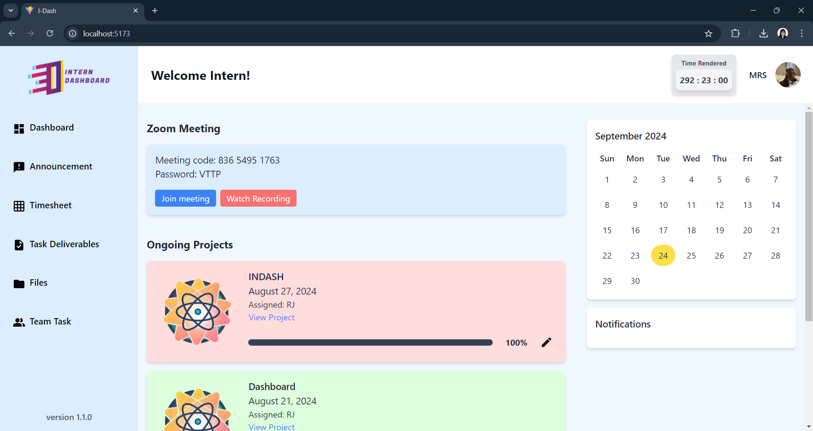
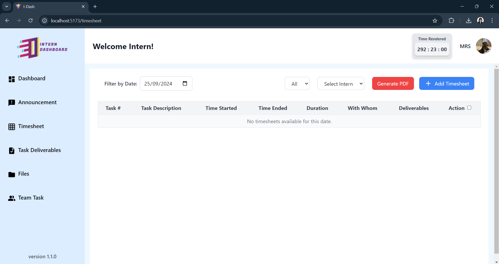
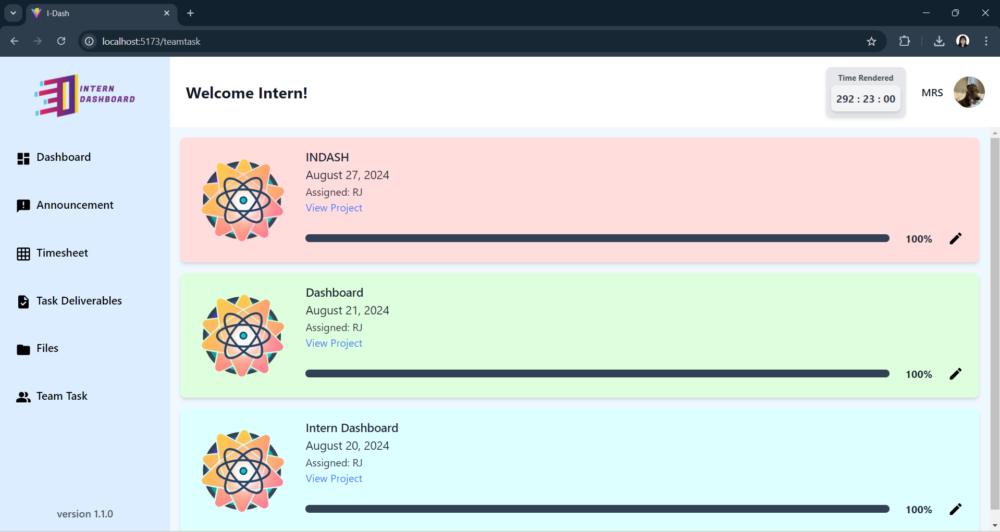
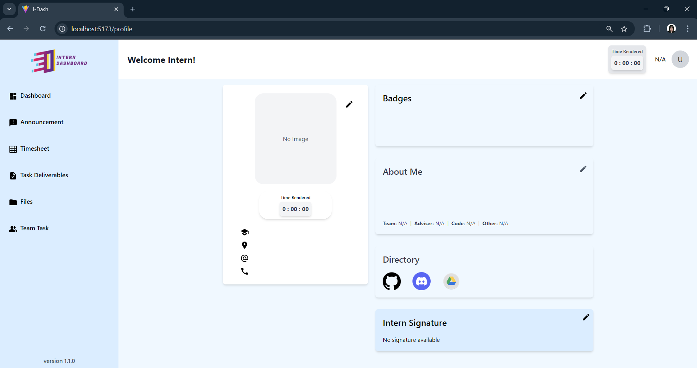
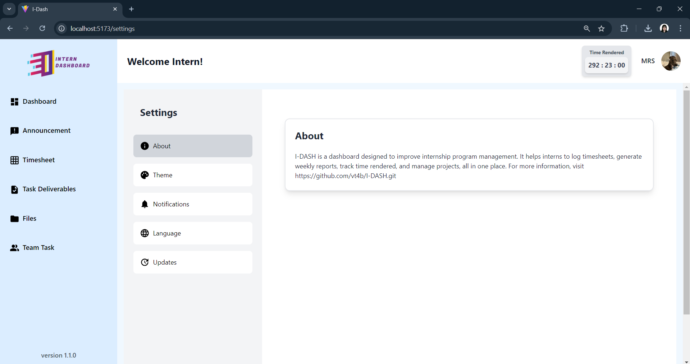

# I-DASH
---
# Intern Dashboard Documentation

---

## Table of Contents
1. [Introduction](#introduction)
2. [Prerequisites](#prerequisites)
3. [Initial Installation](#initial-installation)
4. [Functions](#functions)
5. [User Guide](#user-guide)

---

## Introduction
**I-Dash** is a comprehensive dashboard designed to enhance the management of internship programs. It offers a variety of features that allow users to efficiently log timesheets, generate reports, manage team projects, and more. With I-Dash, interns and group leaders can collaborate and stay organized on a centralized platform.

---

## Prerequisites
Before setting up I-Dash, ensure you have the following installed:

- [Node.js](https://nodejs.org/) (v14.x or later)
- [npm](https://www.npmjs.com/) (v6.x or later)

---

### Initial Installation Guide

#### 1. Clone the Repository
- Open your terminal and run the following commands to clone the repository and navigate into the project directory:
   ```bash
   git clone https://github.com/vt4b/I-DASH.git
   cd I-DASH
   ```
   - **Note:** Ensure you are in the correct directory (`I-DASH`) after cloning the repository.

#### 2. Install Dependencies
- Run the following command to install all required dependencies:
   ```bash
   npm install
   ```
   - This will install all the packages listed in the `package.json` file.

#### 3. Set Up Environment Variables
- Open the `.env` file in the root directory of the project.
- Add your intern credentials to the environment variables to configure access to the API.

   **Example Configuration:**
   ```env
   # Base URL for the API
   VITE_API_BASE_URL=https://idash.visible.team/wp-json/wp/v2/

   # Intern Credentials for Authentication
   VITE_AUTH_USERNAME=YOUR_USERNAME
   VITE_AUTH_PASSWORD=YOUR_PASSWORD
   ```
   - **Replace `YOUR_USERNAME` and `YOUR_PASSWORD`** with your actual intern username and password.

#### 4. Start the Development Server
- Start the development server by running:
   ```bash
   npm run dev
   ```
   - This will start the development server, and you can view the application in your browser at the address provided 
   - Access the I-Dash at `http://localhost:5173`

---

## Features 
### 1. Dashboard
- Access the Zoom meeting link for daily meetings.
- Watch previous meeting recordings for reference.
- View the current month with highlighted dates.
- Displays active projects.



---

### 2. Announcements
- View and post important announcements.
- Stay informed about internship rules and guidelines.


---

### 3. Timesheet
- Log working hours and view time entries.
- Generate timesheet reports in PDF format.
- Filter by date and select specific interns for viewing.
- Used by group leader during daily status meetings.



---

### 4. Task Deliverables
- Track assigned tasks, issues, and archives.
- Editable only by group leaders.


---

### 5. Files
- Access and manage uploaded internship-related files, including OJT documents, media files, and other task deliverables.

 

---

### 6. Team Task
- Monitor team tasks and overall project progress.



---

### 7. Time Rendered
- Tracks the total time worked throughout the program, connected to the timesheet feature. 

---

### 8. Profile

- This section allows you to manage your personal and internship details, upload your digital signature, and add badges. The information provided here will be used for generating your weekly report.


#### Profile Customization Guide
1. **Name**  - This will be the display name used in your weekly report.

2. **University**  - Specify the university you are attending.

3. **Address**  - Provide your current residential address.

4. **Email**  - Enter your email address for contact purposes.

5. **Telephone**  - Provide a valid contact number.

#### Badges
- **Upload Your Team Badges**  - You can upload your team badges here, which will be displayed on your profile.

#### About Me
1. **Team**  - Select your team. This will determine which team tasks or projects are assigned to you.

2. **Adviser**  - Enter the name of your OJT adviser. This field is required as it will be used in the generated weekly report PDF.

3. **Code**  - Enter the subject code. This will be used in the headings of your weekly report.

4. **Other**  - Specify any additional roles or responsibilities, such as group leader. This will grant access to the timesheets and task deliverables of all interns in your group.

#### Intern Signature
- **Upload Signature** – Upload your digital signature. This will be used in your generated weekly report. Make sure to remove the background of the signature image before uploading.




---

### 9. Notifications
- Notify interns about newly posted announcements, tasks, guidelines, and rules.

---

### 10. Settings
- **About**: Information about the application.
- **Theme**: Customize the dashboard's appearance by switching between light mode and dark mode.
- **Notifications**: Manage notification preferences.
- **Language**: Set your preferred interface language.
- **Updates**: Stay informed about the latest features and changes.



---

## User Guide
### Generate PDF Feature
1. Click the "Generate PDF" button, then choose a week to generate.
2. Check the checklist to select or deselect activities you want to include or exclude from your weekly report.
3. Once you’re done customizing activities, proceed to the PDF preview and check the output.
4. Drag your signature to the correct place. Ensure you have uploaded your signature on the Profile page.
5. Download the PDF.

---
### Thank you for using I-Dash!
